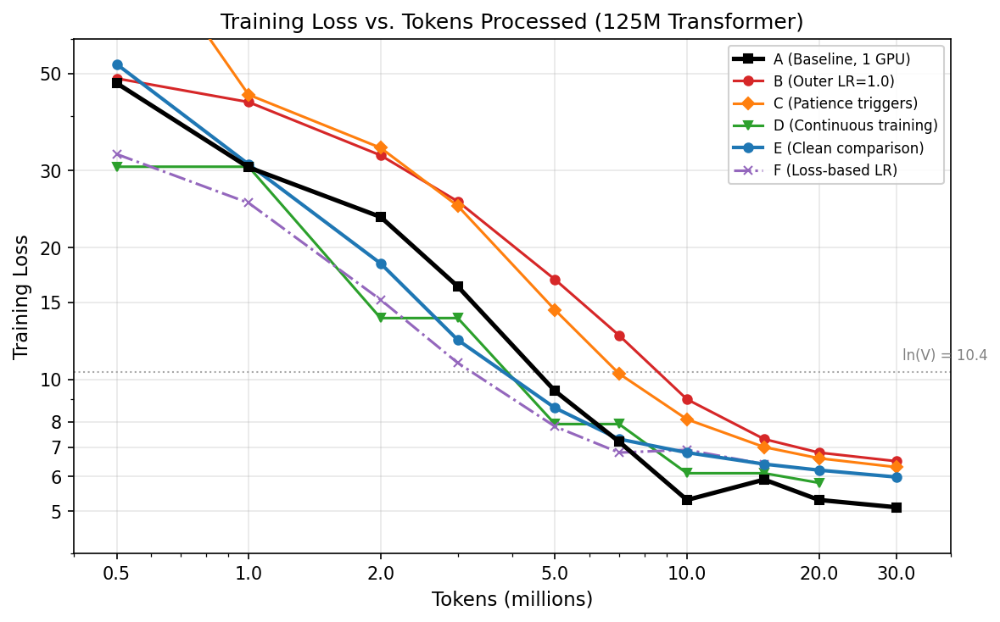
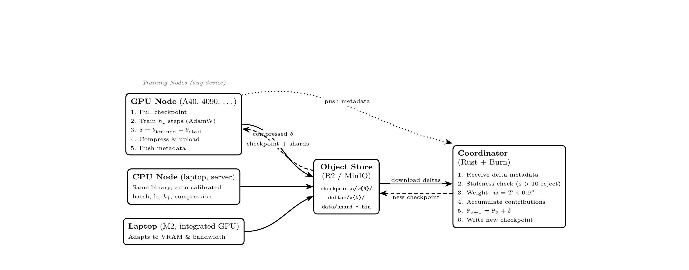

# Distrain

Asynchronous distributed LLM training with zero synchronization. Like SETI@home turned idle computers into a radio telescope, Distrain turns idle GPUs and CPUs into an AI training cluster.

Multiple GPUs train the same model without coordination. Each device trains locally, pushes weight updates to a coordinator, and the coordinator merges them. No AllReduce, no synchronous rounds, no waiting for the slowest node. A datacenter GPU and a gaming PC participate in the same training run. Each auto-configures and contributes proportionally.

Written entirely in Rust using the [Burn](https://github.com/tracel-ai/burn) deep learning framework. Single binary, no Python runtime, no PyTorch. The same source code compiles to CUDA, Metal, Vulkan, and CPU. Download one ~20 MB file and start training.

> **Status: Research preview.** The protocol works and the code runs, but this is not production software. We're looking for collaborators to test on larger models, more nodes, and real-world network conditions. See [Contributing](#contributing) below.

## Results

We trained a 125M parameter transformer across six experiment curves, measuring the gap between distributed and single-GPU training:

| Curve | Hardware | Plateau Loss | Gap to Baseline | Key Change |
|-------|----------|-------------|-----------------|------------|
| A (Baseline) | 1× RTX 4000 Ada | 4.8 | — | Single GPU, batch=4, lr=3e-4 |
| B | 3× mixed RTX | 6.4 | +1.6 | Outer LR→1.0, compression tuning |
| C | 3× RTX A4000 | 6.0 | +1.2 | Patience triggers, all nodes contributing |
| D | 3× A40 | 5.8 | +1.0 | Continuous training (GPU never idles) |
| E | 3× A40 | 5.98 | +1.2 | Clean comparison: same hyperparams as baseline |
| F | 3× A40 | 6.4 | +1.6 | Loss-based lr (negative result) |

We also validated on heterogeneous consumer hardware: two Apple Silicon laptops and one Intel CPU trained together for 2,928 checkpoints despite a 10× throughput gap, reaching loss 6.7.



Validation loss on held-out data matches training loss within 0.4%, confirming training loss is a reliable proxy for generalization at this data utilization level (<2%).

**Key findings:**

- **The gap is 1.0-1.2 points** between distributed (3 nodes) and single-GPU baseline. This comes from compression loss (~10% signal per round) and checkpoint merge staleness (~30s per merge on CPU).
- **More contributors = better quality.** 3-contribution checkpoints consistently outperform 2-contribution ones.
- **Consumer hardware works.** Two Apple Silicon laptops and one Intel CPU trained together across a 10× throughput gap for 2,928 checkpoints.
- **Compression is tunable.** Top-k retention ranges from 1% (tiny deltas, more signal loss) to 99% (near-raw, best quality). The system auto-selects based on measured upload bandwidth. On fast connections, it sends near-raw deltas for maximum quality.

## Architecture



## The protocol

Each node:
1. Downloads the latest checkpoint
2. Trains continuously (GPU never idles between rounds)
3. Compresses the delta based on measured upload bandwidth. Raw if the connection is fast, top-k sparsification + zstd if not. Error feedback accumulates dropped values so they re-enter future pushes (resets at checkpoint boundaries).
4. Uploads to object storage, notifies the coordinator
5. Coordinator merges deltas with staleness-weighted averaging (merged delta applied directly, no scaling)
6. New checkpoint produced, training continues without pause

Stale deltas get exponentially less weight: `0.9^staleness`. The merge is commutative within each accumulation window.

## Everything auto-tunes

| Parameter | How it's determined |
|-----------|-------------------|
| Batch size | Computed from GPU VRAM + model architecture. OOM → halve and retry. |
| Learning rate | Constant (3e-4 default) or loss-based decay. Constant worked best in experiments. |
| Steps per push | Measured from actual upload time |
| Compression | Bandwidth-adaptive: raw if fast, compressed if slow |
| Shards in memory | Computed from available RAM |
| Contribution weight | Tokens processed × staleness decay |
| Min contributions | Auto-computed from active node count |

## Model presets

Training a different model size is just an environment variable:

| Preset | Params | Hidden | Layers | Heads | KV Heads | FFN | VRAM needed |
|--------|--------|--------|--------|-------|----------|-----|-------------|
| `micro-test` | ~64K | 64 | 2 | 4 | 2 | 128 | <1 GB |
| `tiny` | 125M | 768 | 12 | 12 | 4 | 2048 | ~8 GB |
| `small` | 1.13B | 2048 | 24 | 16 | 4 | 5504 | ~40 GB |
| `medium` | 7B | 4096 | 32 | 32 | 8 | 11008 | ~80 GB |
| `large` | 13B | 5120 | 40 | 40 | 8 | 13824 | ~160 GB |

Set `PRESET=small` on the coordinator to bootstrap a 1B model. Nodes auto-detect the architecture from the checkpoint.

## Running it

### Docker deployment (recommended)

Three steps: start coordinator, prepare training data (once), start nodes.

**Step 1: Start the coordinator**

The coordinator image includes MinIO (S3-compatible storage), bootstraps a random v0 checkpoint on first start, and persists all data on the `/workspace` volume.

```bash
docker run --gpus all \
  -e S3_ACCESS_KEY=distrain \
  -e S3_SECRET_KEY=yoursecret \
  -e PRESET=tiny \
  -v distrain-data:/workspace \
  -p 8000:8000 -p 9000:9000 -p 22:22 \
  ghcr.io/frane/distrain/coordinator:latest
```

**Step 2: Prepare training data (once per dataset)**

The coordinator image includes `prepare_data.py` and the Mistral v0.3 tokenizer. SSH or exec into the container and run:

```bash
python3 /scripts/prepare_data.py fineweb-edu-10bt \
  --output-dir /tmp/data \
  --upload \
  --s3-endpoint http://localhost:9000 \
  --s3-bucket distrain-training \
  --s3-access-key distrain \
  --s3-secret-key yoursecret
```

This downloads FineWeb-Edu from HuggingFace (~10B tokens), tokenizes it (~1 hour), and uploads 1,102 shards to MinIO. You only need to do this once.

**Step 3: Start training nodes**

```bash
docker run --gpus all \
  -e COORDINATOR_URL=http://your-coordinator:8000 \
  -e S3_ENDPOINT=http://your-coordinator:9000 \
  -e S3_ACCESS_KEY=distrain \
  -e S3_SECRET_KEY=yoursecret \
  -e S3_BUCKET=distrain-training \
  ghcr.io/frane/distrain/node-cuda:latest
```

Each node auto-detects its GPU, computes optimal batch size, and starts training immediately. Start as many nodes as you want.

### Local development

```bash
cargo build --release -p distrain-coordinator -p distrain-node

# Start MinIO (local S3)
docker compose -f docker/docker-compose.yml up -d minio

# Prepare training data
pip install datasets tokenizers numpy tqdm
python scripts/prepare_data.py fineweb-edu-10bt --output-dir data/fineweb --upload

# Bootstrap a model
./target/release/distrain-node bootstrap --config node.toml --preset tiny

# Run coordinator
RUST_LOG=info ./target/release/coordinator

# Run node (separate terminal)
./target/release/distrain-node start --config node.toml
```

## What's here

```
coordinator/        HTTP server (Axum) + aggregation (burn tensors)
core/model/         Transformer, compression, checkpointing (Burn)
core/shared/        Storage client, config, shared types
node/cli/           Training node (continuous training, auto-tuning)
node/desktop/       Tauri desktop app (experimental)
node/browser/       WebAssembly version (experimental)
node/ffi/           C FFI for mobile (experimental)
scripts/            Data prep, eval, post-training
docker/             Local dev stack (MinIO, Prometheus, Grafana)
```

## Configuration reference

### Coordinator (environment variables)

| Variable | Default | Description |
|----------|---------|-------------|
| `PRESET` | `tiny` | Model size: `micro-test`, `tiny`, `small`, `medium`, `large` |
| `COORDINATOR_PORT` | `8000` | HTTP API port |
| `S3_ACCESS_KEY` | `minioadmin` | MinIO / S3 access key |
| `S3_SECRET_KEY` | `minioadmin` | MinIO / S3 secret key |
| `S3_BUCKET` | `distrain-training` | Storage bucket name |
| `S3_REGION` | `us-east-1` | S3 region |
| `S3_EXTERNAL_ENDPOINT` | (none) | Public S3 URL for nodes (if different from internal) |
| `MIN_CONTRIBUTIONS` | `0` | Override min contributions per checkpoint. 0 = auto (half of active nodes) |
| `MAX_STALENESS` | `30` | Max checkpoint versions a delta can be behind before rejection |
| `VOCAB_SIZE` | `32768` | Vocabulary size (must match tokenizer) |
| `KEEP_VERSIONS` | `3` | Number of old checkpoints to retain before cleanup |
| `MIN_WEIGHT` | `0` | Minimum total weight before checkpoint production |
| `RUST_LOG` | `info` | Log level (`debug`, `info`, `warn`, `error`) |

### Node (environment variables)

| Variable | Default | Description |
|----------|---------|-------------|
| `COORDINATOR_URL` | `http://localhost:8000` | Coordinator HTTP endpoint |
| `S3_ENDPOINT` | `http://localhost:9000` | S3/MinIO endpoint for data and checkpoints |
| `S3_ACCESS_KEY` | `minioadmin` | S3 access key |
| `S3_SECRET_KEY` | `minioadmin` | S3 secret key |
| `S3_BUCKET` | `distrain-training` | Storage bucket |
| `S3_REGION` | `us-east-1` | S3 region |
| `GPU_DEVICE` | `0` | GPU device index. `-1` for CPU |
| `BATCH_SIZE` | (auto) | Force batch size. If unset, auto-detected from VRAM + model architecture |
| `MIN_INNER_STEPS` | `50` | Minimum steps per push (H_mini floor) |
| `MAX_INNER_STEPS` | `500` | Maximum steps per push (H_mini ceiling) |
| `PUSH_INTERVAL` | `60.0` | Target seconds between pushes (used for initial H_mini before bandwidth measurement) |
| `LR_MODE` | `loss_based` | Learning rate mode: `loss_based` (decays with training loss) or `constant` |
| `RUST_LOG` | `info` | Log level |

### Node (node.toml fields)

These can also be set in `node.toml` for local development:

| Field | Type | Description |
|-------|------|-------------|
| `coordinator_url` | string | Coordinator endpoint |
| `api_key` | string | API key (currently unused) |
| `gpu_device` | int | GPU index, -1 for CPU |
| `target_push_interval_secs` | float | Target push interval |
| `min_inner_steps` | int | H_mini floor |
| `max_inner_steps` | int | H_mini ceiling |
| `cache_dir` | string | Local cache for checkpoints and shards |
| `max_cache_gb` | int | Max cache disk usage (auto-detected from disk in Docker) |
| `batch_size` | int (optional) | If set, forces batch size. If absent, auto-detected from VRAM |
| `force_batch_size` | int (optional) | Alias for batch_size (backwards compat) |
| `seq_len` | int | Sequence length (default 512) |
| `max_memory_fraction` | float | Max fraction of RAM to use (default 0.8) |
| `storage.endpoint` | string | S3 endpoint |
| `storage.bucket` | string | Bucket name |
| `storage.access_key_id` | string | S3 access key |
| `storage.secret_access_key` | string | S3 secret key |
| `storage.region` | string | S3 region |

## Open questions and known limitations

These are the real problems we haven't solved yet:

- **1.0-1.2 point quality gap.** Distributed training plateaus above single-GPU. The gap comes from compression loss (~10% of gradient signal per round) and merge staleness (~30s of training against an outdated checkpoint). GPU-accelerated aggregation and delta streaming (more frequent, smaller pushes) are promising directions.

- **Delta size vs quality tradeoff.** Raw deltas give the best quality but are large (300MB for 125M, ~14GB for 7B). Top-k compression reduces size but loses signal. Low-rank compression (SVD) was tested and fails for pre-training deltas (88-98% reconstruction error; pre-training deltas are full-rank, unlike fine-tuning). The system auto-adapts compression to bandwidth, but residential internet users will always get worse quality than datacenter nodes.

- **Only validated at small scale.** 125M parameters, 3 nodes. The protocol is designed for 7B+ models with 50-1000 nodes, but staleness handling, merge quality, and coordinator throughput at that scale are untested.

- **Single coordinator.** One server handles all merges. It's stateless (all data in S3) and can be restarted, but it's a single point of failure. Peer-to-peer topology is a natural extension.

- **No security.** No authentication on delta pushes. Anyone who finds the coordinator can submit garbage. Real deployment needs signed contributions and verification.

- **Coordinator persistence is fragile.** MinIO data on a Docker volume works but isn't robust. A cloud-native deployment with proper S3 (R2, AWS) would be more reliable.

## Future directions

- **Staleness recovery.** Currently stale deltas get down-weighted or discarded. Delta rebasing (subtracting accumulated model drift before merging) could preserve the novel gradient signal from slow nodes. For extremely stale contributions, proxy replay (fast node retrains on slow node's data selection) recovers data coverage without parameter staleness.
- **Structured compression.** Current top-k selects individual values. Block sparsity (selecting entire rows/blocks by aggregate norm) would reduce index overhead and preserve gradient coherence. Combined with importance-weighted selection, this could improve both compression ratio and quality.
- **Scale validation.** Public volunteer campaign to test beyond 3 nodes. How does the convergence gap change with node count? Where does the coordinator bottleneck?
- **1B clean experiment.** Matched single-GPU baseline for the 1B model, addressing the main experimental gap.
- **GPU aggregation.** Coordinator implements weighted averaging via Burn tensors (CUDA when built with `--features cuda`). Experiments used CPU. GPU aggregation should reduce merge time from 30s to <1s.
- **Desktop app.** Tauri shell exists (`node/desktop/`). Needs UI polish for non-technical users.
- **Browser training.** WebAssembly node compiles (`node/browser/wasm/`). Limited by WebGPU maturity.

## Contributing

We're looking for people to help with:

- **Run experiments on consumer GPUs.** We've tested on A40s and Macs. What happens with RTX 3060s, 4070s, mixed AMD/NVIDIA clusters? How does residential internet affect quality?
- **Scale testing.** 10, 50, 100 nodes. Does the protocol hold? Where does the coordinator bottleneck?
- **Bigger models.** 1B and 7B training runs. Do the same optimizations (constant lr, batch=4, high retention) work at scale?
- **Compression research.** Better ways to shrink deltas without losing signal. Structured sparsity, learned compression, hybrid approaches.
- **Infrastructure hardening.** Better persistence, fault tolerance, authentication.

If you're interested, open an issue or reach out. The codebase is ~15K lines of Rust, well-structured, with Docker images that just work.

## Related work

- [DiLoCo](https://arxiv.org/abs/2311.08105) (Google, 2023). Inner-outer optimization, requires synchronous outer steps.
- [OpenDiLoCo / INTELLECT-1](https://www.primeintellect.ai/blog/intellect-1) (Prime Intellect). 10B across continents, synchronous outer steps.
- [DeMo / DisTrO](https://arxiv.org/abs/2411.19870) (Nous Research). 857× bandwidth reduction via decoupled momentum, retains synchronous all-reduce.
- [Hivemind](https://github.com/learning-at-home/hivemind) (Together.ai). PyTorch library for decentralized training.

Distrain is the only system that eliminates synchronization entirely. Nodes push independently, no agreement step. Single Rust binary, no Python, zero-configuration.

## Paper

The full paper is included in this repository as [`paper.pdf`](paper.pdf).
It is not yet on arXiv. If you reference this work, please cite as:

```bibtex
@unpublished{bandov2026distrain,
  title  = {Distrain: Asynchronous Weighted-Contribution Training of Language Models Across Heterogeneous Devices},
  author = {Bandov, Frane},
  year   = {2026},
  note   = {Manuscript. \url{https://github.com/frane/distrain/blob/main/paper.pdf}},
}
```

## License

MIT
